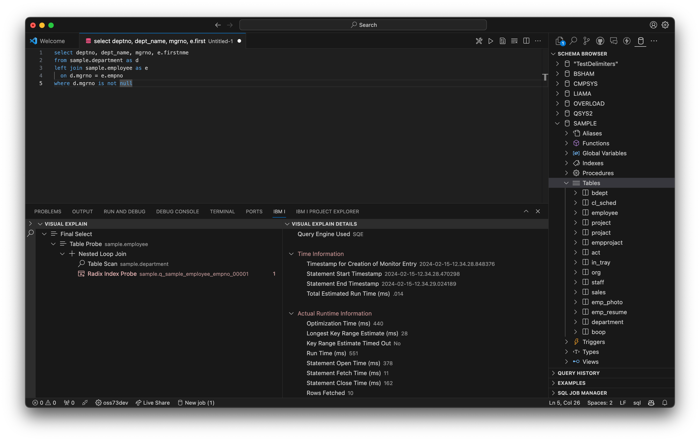

The Db2 for i extension allows users to browse database schemas, execute SQL statements, and more, on an IBM i.


## Install

The extension can be [installed from the Marketplace](https://marketplace.visualstudio.com/items?itemName=HalcyonTechLtd.vscode-db2i) and is also part of the [IBM i Development Pack](https://marketplace.visualstudio.com/items?itemName=HalcyonTechLtd.ibm-i-development-pack).

### Server Component

As of 0.3.0, the Db2 for i extension requires a server component. The component provides improved performance and makes it easy for us to add advanced features. The Db2 for i extension manages the server component installation when you connect to an IBM i with Code for IBM i and will ask the user to confirm any installation or update. The server component is installed into `$HOME/.vscode`, which means a per-user installation. [The server component is also open-source](https://github.com/ThePrez/CodeForIBMiServer).

## Executing statements

Either:

* open an existing `.sql` file (source member, streamfile or local file)
* create a new file
    1. create a file (control / command + N)
    2. change the language ID to `sql`

After you have an SQL file open, you can either:

* Move your cursor onto the statement you want to execute and:
    * use the play button in the top right to execute
    * use the shortcut (control / command + R) to execute the statement

The result set will appear below the statement. As your scroll through the result set, more data will load. When you execute an SQL statement, it will be prepended to your Query History view, where it remains readily accessible.

SQL statements are executed using the active job selected in the SQL Job Manager view.

### SQL processors

Newer version of SQL provided by Db2 for i allows you to run CL commands in a script. There are also `json`, `csv`, and `sql` processors, which will open the result set in the chosen format.

```sql
-- result set as normal table
select * from sample.employee;

-- result set as JSON, will open in a new file
json: select * from sample.employee;

-- result set as CSV, will open in a new file
csv: select * from sample.employee;

-- result set as SQL insert statement
sql: select * from sample.employee;

-- run CL commands. output is directed to IBM i output channel
cl: dspffd sample/employee
```

## SQL Job Manager

This view allows users to manage different SQL jobs, each with their own unique JDBC configuration. A new job can be created by clicking the database icon in the SQL Job Manage title bar. Or, if you have not created a new job before, there is a big button to do the same action.


Your active job will be marked with a highlighted icon. **The active job is used for all SQL statement execution, ** including SQL that powers the Schema Browser, user-executed SQL statements, etc. You can change the active job by simply clicking the job you choose to use. You will see the highlighted icon change to indicate the active job.

### Editing job configuration

You can use the pencil icon on any job to edit the JDBC properties. When the Apply Changes button is pressed, any changes are saved and the job is restarted, to fully apply the changes.

You are able to right-click on any job to save those job settings, allowing it to be easily reused. Using the 'Save settings to config' right-click action will prompt you to enter a name for the configuration. Once saved, you will see a 'Saved Configuration' folder appear, with all your saved configs. Clicking on a saved config will launch a new job with those pre-defined settings. You can use the pencil icon on any saved configuration to edit it.

## Using the Schema Browser

The Db2 for i extension adds a view called Schema Browser which allows the user to add existing schemas to the list and will allow them to browse existing database objects. You can right-click on SQL objects to show more actions. Each SQL object type may have unique actions. 

### Viewing table contents

If you are using the Schema Browser to browse objects, you are able to use the 'View contents' icon when hovering over a table, view, or alias to cause a basic SQL select statement to be generated and executed.

## Visual Explain

We have added Visual Explain into the database extension with a more lightweight approach of explain data. The typically run button on the document now has options to either run, run and explain or explain without running, which will show the explain nodes and node details in the same result set view.

The Visual Explain view has button on the header to control which nodes should be highlights, as well as the ability to export the data as JSON, and more.

